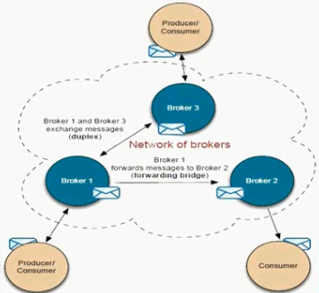

## ActiveMQ的静态网络链接

#### ActiveMQ的networkConnector是什么

​	在某些场景下，需要多个ActiveMQ的Broker做集群，那么就涉及到Broker到Broker的通信，这个被称为ActiveMQ的networkConnector。

​	默认是单向的，一个Broker在一端发送消息，另一Broker在另一端接收消息。这就是所谓的“桥接”。也支持双相连接。



#### “discovery”的概念

​	一般情况下，discovery是被用来发现远程的服务，客户端通常想去发送所有可利用的brokers:另一层意思，它是基于现有网络Broker去发现其他可用的Broker。

​	有两种配置Client到Broker的链接方式， 一种方式： Client通过Statically配置的方式去连接Broker，一种方式：Client通过discovery agents来dynamically发现Brokers


#### Static network

​	Static networkConnector 是用于创建一个静态的配置对于网络中的多个Broker。这种协议用于复合url，一个复合url包括多个url地址。配置实例如下：

```xml
<networkConnectors>
    <networkConnector name="local netework" uri="static://(tcp://remotehost:61616,tcp://remotehost2:61616)" />
</networkConnectors>
```


主要测试代码

```java
public class QueueSender {
    public static void main(String[] args) {
        ConnectionFactory connectionFactory=new ActiveMQConnectionFactory("tcp://192.168.0.3:61776");
        Connection connection=connectionFactory.createConnection();
        connection.start();
        Session session=connection.createSession(Boolean.TRUE,Session.CLIENT_ACKNOWLEDGE);
        Destination destination=session.createQueue("my-queue");
        MessageProducer producer=session.createProducer(destination);
        for (int i = 0; i < 30; i++) {
            TestMessage message=session.createTextMessage("message---"+i);
            producer.send(message);
        }
		//下面省略
    }
}
```

```java
public class QueueReceiver1 {  
    //QueueReceiver2基本上和QueueReceiver1一样，只要tcp地址不一样，输出消息有差异即可
    public static void main(String[] args) {
        ConnectionFactory cf=new ActiveMQConnectionFactory("tcp://192.168.0.3:61676");

        for (int i = 0; i < 10; i++) {
          Thread t=  new MyThread(cf);
          t.start();
          try{
              Thread.sleep(1000L);
          }catch (InterruptedException e){
              e.printStackTrace();
          }
        }
    }
}

class MyThread extends  Thread{
    private ConnectionFactory cf =null;
    public MyThread(ConnectionFactory cf){
        this.cf=cf;
    }

    @Override
    public void run() {
        try {
            final Connection connection=cf.createConnection();
            connection.start();
            final Session session=connection.createSession(Boolean.TRUE,Session.AUTO_ACKNOWLEDGE);
            Destination destination=session.createQueue("my-queue");
            MessageConsumer consumer=session.createConsumer(destination);
            consumer.setMessageListener(new MessageListener(){
               public void onMessage(Message msg){
                   if (!msg instanceof TextMessage){
                       try{
                           session.commit();
                       }catch(JMSException e){
                           e.printStackTrace();
                       }
                   }
                   TextMessage txtMsg=(TextMessage)msg;
                   try{
                       System.out.println("Receiver111==="+txtMsg.getText());
                   }catch(JMSException e1){
                       e1.printStackTrace();
                   }
                   try{
                       session.commit();
                   }catch(JMSException e){
                       e.printStackTrace();
                   }
                   try{
                       connection.close();
                   }catch (JMSException e){
                       e.printStacktrace();
                   }
               }
            });
        }}
    }
}
```