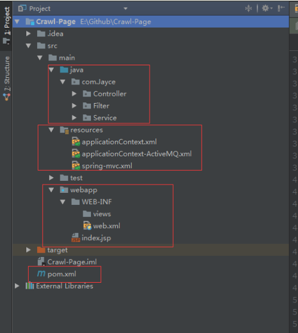

## Spring结合ActiveMQ使用

 

##### 1、pom文件引入依赖

```xml
<project xmlns="http://maven.apache.org/POM/4.0.0" xmlns:xsi="http://www.w3.org/2001/XMLSchema-instance"
  xsi:schemaLocation="http://maven.apache.org/POM/4.0.0 http://maven.apache.org/maven-v4_0_0.xsd">
  <modelVersion>4.0.0</modelVersion>
  <groupId>Crawl-Page</groupId>
  <artifactId>Crawl-Page</artifactId>
  <packaging>war</packaging>
  <version>1.0-SNAPSHOT</version>
  <name>Crawl-Page Maven Webapp</name>
  <url>http://maven.apache.org</url>
  <!-- 版本管理 -->
  <properties>
    <springframework>4.1.8.RELEASE</springframework>
  </properties>

  <dependencies>
    <dependency>
      <groupId>junit</groupId>
      <artifactId>junit</artifactId>
      <version>4.10</version>
      <scope>test</scope>
    </dependency>


  <!-- JSP相关 -->
  <dependency>
    <groupId>jstl</groupId>
    <artifactId>jstl</artifactId>
    <version>1.2</version>
  </dependency>
  <dependency>
    <groupId>javax.servlet</groupId>
    <artifactId>servlet-api</artifactId>
    <scope>provided</scope>
    <version>2.5</version>
  </dependency>


    <!-- spring -->
    <dependency>
      <groupId>org.springframework</groupId>
      <artifactId>spring-core</artifactId>
      <version>${springframework}</version>
    </dependency>
    <dependency>
      <groupId>org.springframework</groupId>
      <artifactId>spring-context</artifactId>
      <version>${springframework}</version>
    </dependency>
    <dependency>
      <groupId>org.springframework</groupId>
      <artifactId>spring-tx</artifactId>
      <version>${springframework}</version>
    </dependency>
    <dependency>
      <groupId>org.springframework</groupId>
      <artifactId>spring-webmvc</artifactId>
      <version>${springframework}</version>
    </dependency>
    <dependency>
      <groupId>org.springframework</groupId>
      <artifactId>spring-jms</artifactId>
      <version>${springframework}</version>
    </dependency>
    <!-- xbean 如<amq:connectionFactory /> -->
    <dependency>
      <groupId>org.apache.xbean</groupId>
      <artifactId>xbean-spring</artifactId>
      <version>3.16</version>
    </dependency>

    <!-- activemq -->
    <dependency>
      <groupId>org.apache.activemq</groupId>
      <artifactId>activemq-core</artifactId>
      <version>5.7.0</version>
    </dependency>
    <dependency>
      <groupId>org.apache.activemq</groupId>
      <artifactId>activemq-pool</artifactId>
      <version>5.12.1</version>
    </dependency>

    <!-- 自用jar包，可以忽略-->
    <dependency>
      <groupId>commons-httpclient</groupId>
      <artifactId>commons-httpclient</artifactId>
      <version>3.1</version>
    </dependency>
  </dependencies>

  <build>
    <finalName>Crawl-Page</finalName>
    <plugins>
      <plugin>
        <groupId>org.apache.tomcat.maven</groupId>
        <artifactId>tomcat7-maven-plugin</artifactId>
        <configuration>
          <port>8080</port>
          <path>/</path>
        </configuration>
      </plugin>
    </plugins>
  </build>

</project>
```

##### 2、web.xml	指定Spring 配置文件，springMvc 命名，编码格式

```xml
<?xml version="1.0" encoding="UTF-8"?>
<web-app xmlns="http://java.sun.com/xml/ns/javaee"
         xmlns:xsi="http://www.w3.org/2001/XMLSchema-instance"
         xsi:schemaLocation="http://java.sun.com/xml/ns/javaee
          http://java.sun.com/xml/ns/javaee/web-app_3_0.xsd"
         version="3.0">

  <display-name>Archetype Created Web Application</display-name>

  <!-- 加载spring的配置文件，例如hibernate、jms等集成 -->
  <context-param>
    <param-name>contextConfigLocation</param-name>
    <param-value>
      classpath:applicationContext*.xml;
    </param-value>
  </context-param>

  <listener>
    <listener-class>org.springframework.web.context.ContextLoaderListener</listener-class>
  </listener>

  <servlet>
    <servlet-name>springMVC</servlet-name>
    <servlet-class>org.springframework.web.servlet.DispatcherServlet</servlet-class>
    <init-param>
      <param-name>contextConfigLocation</param-name>
      <param-value>classpath:spring-mvc.xml</param-value>
    </init-param>
    <load-on-startup>1</load-on-startup>
  </servlet>
  <servlet-mapping>
    <servlet-name>springMVC</servlet-name>
    <url-pattern>/</url-pattern>
  </servlet-mapping>

  <!-- 处理编码格式 -->
  <filter>
    <filter-name>characterEncodingFilter</filter-name>
    <filter-class>org.springframework.web.filter.CharacterEncodingFilter</filter-class>
    <init-param>
      <param-name>encoding</param-name>
      <param-value>UTF-8</param-value>
    </init-param>
    <init-param>
      <param-name>forceEncoding</param-name>
      <param-value>true</param-value>
    </init-param>
  </filter>
  <filter-mapping>
    <filter-name>characterEncodingFilter</filter-name>
    <url-pattern>/*</url-pattern>
  </filter-mapping>

</web-app>
```

##### 3、SpringMvc.xml

```xml
<?xml version="1.0" encoding="UTF-8"?>
<!-- 查找最新的schemaLocation 访问 http://www.springframework.org/schema/ -->
<beans xmlns="http://www.springframework.org/schema/beans"
       xmlns:aop="http://www.springframework.org/schema/aop"
       xmlns:context="http://www.springframework.org/schema/context"
       xmlns:mvc="http://www.springframework.org/schema/mvc"
       xmlns:tx="http://www.springframework.org/schema/tx"
       xmlns:xsi="http://www.w3.org/2001/XMLSchema-instance"
       xsi:schemaLocation="http://www.springframework.org/schema/aop
        http://www.springframework.org/schema/aop/spring-aop-4.0.xsd
        http://www.springframework.org/schema/beans
        http://www.springframework.org/schema/beans/spring-beans-4.0.xsd
        http://www.springframework.org/schema/context
        http://www.springframework.org/schema/context/spring-context-4.0.xsd
        http://www.springframework.org/schema/mvc
        http://www.springframework.org/schema/mvc/spring-mvc-4.0.xsd
        http://www.springframework.org/schema/tx
        http://www.springframework.org/schema/tx/spring-tx-4.0.xsd">

    <!-- 启用MVC注解 -->
    <mvc:annotation-driven />
    <!-- 指定Sping组件扫描的基本包路径 -->
    <context:component-scan base-package="com.Jayce" >
        <!-- 这里只扫描Controller，不可重复加载Service -->
        <context:include-filter type="annotation" expression="org.springframework.stereotype.Controller"/>
    </context:component-scan>

    <!-- JSP视图解析器-->
    <bean class="org.springframework.web.servlet.view.InternalResourceViewResolver">
        <property name="prefix" value="/WEB-INF/views/" />
        <property name="suffix" value=".jsp" />
        <!--  定义其解析视图的order顺序为1 -->
        <property name="order" value="1" />
    </bean>
</beans><!--这里设置各个消息队列的重发机制-->  
    <bean id="redeliveryPolicyMap" class="org.apache.activemq.broker.region.policy.RedeliveryPolicyMap">  
        <property name="redeliveryPolicyEntries">  
            <list>  
                <ref bean="bizRedeliveryPolicy"/>  
                <ref bean="mailRedeliveryPolicy"/>  
            </list>  
        </property>  
    </bean>  
    <bean id="bizRedeliveryPolicy" class="org.apache.activemq.RedeliveryPolicy">  
        <!--重发次数 延时、延时系数、延时指数开关、目标（重发等待时间1s, 2s, 4s, 8s）-->  
        <property name="maximumRedeliveries" value="3"/>  
        <property name="redeliveryDelay" value="1000"/>  
        <property name="backOffMultiplier" value="2"/>  
        <property name="useExponentialBackOff" value="true"/>  
        <property name="destination" ref="bizQueue"/>  
    </bean>  
    <bean id="mailRedeliveryPolicy" class="org.apache.activemq.RedeliveryPolicy">  
        <!--重发次数 延时、延时系数、延时指数开关-->  
        <property name="maximumRedeliveries" value="2"/>  
        <property name="redeliveryDelay" value="5000"/>  
        <property name="destination" ref="mailQueue"/>  
    </bean>  
```

##### 4、applicationContext.xml  :只用来指出包扫描路径

```xml
<?xml version="1.0" encoding="UTF-8"?>
<beans xmlns="http://www.springframework.org/schema/beans"
       xmlns:xsi="http://www.w3.org/2001/XMLSchema-instance"
       xmlns:amq="http://activemq.apache.org/schema/core"
       xmlns:jms="http://www.springframework.org/schema/jms"
       xmlns:context="http://www.springframework.org/schema/context"
       xmlns:mvc="http://www.springframework.org/schema/mvc"
       xsi:schemaLocation="
        http://www.springframework.org/schema/beans
        http://www.springframework.org/schema/beans/spring-beans-4.1.xsd
        http://www.springframework.org/schema/context
        http://www.springframework.org/schema/context/spring-context-4.1.xsd
        http://www.springframework.org/schema/mvc
        http://www.springframework.org/schema/mvc/spring-mvc-4.1.xsd
        http://www.springframework.org/schema/jms
        http://www.springframework.org/schema/jms/spring-jms-4.1.xsd
        http://activemq.apache.org/schema/core
        http://activemq.apache.org/schema/core/activemq-core-5.14.3.xsd">

    <bean class="org.springframework.beans.factory.annotation.AutowiredAnnotationBeanPostProcessor"/>
    <!-- 配置扫描路径 -->
    <context:component-scan base-package="com.Jayce">
        <!-- 只扫描Service，也可以添加Repostory，但是要把Controller排除在外，Controller由spring-mvc.xml去加载 -->
       <context:exclude-filter type="annotation" expression="org.springframework.stereotype.Controller"/>
    </context:component-scan>

</beans>
```

##### 5、applicationContext-ActiveMQ.xml

```xml
<?xml version="1.0" encoding="UTF-8"?>
<beans xmlns="http://www.springframework.org/schema/beans"
       xmlns:xsi="http://www.w3.org/2001/XMLSchema-instance"
       xmlns:amq="http://activemq.apache.org/schema/core"
       xmlns:jms="http://www.springframework.org/schema/jms"
       xmlns:context="http://www.springframework.org/schema/context"
       xmlns:mvc="http://www.springframework.org/schema/mvc"
       xsi:schemaLocation="
        http://www.springframework.org/schema/beans
        http://www.springframework.org/schema/beans/spring-beans-4.1.xsd
        http://www.springframework.org/schema/context
        http://www.springframework.org/schema/context/spring-context-4.1.xsd
        http://www.springframework.org/schema/mvc
        http://www.springframework.org/schema/mvc/spring-mvc-4.1.xsd
        http://www.springframework.org/schema/jms
        http://www.springframework.org/schema/jms/spring-jms-4.1.xsd
        http://activemq.apache.org/schema/core
        http://activemq.apache.org/schema/core/activemq-core-5.12.1.xsd"
>

    <context:component-scan base-package="com.Jayce" />
    <mvc:annotation-driven />

    <amq:connectionFactory id="amqConnectionFactory"
                           brokerURL="tcp://192.168.148.128:61616"
                           userName="admin"
                           password="admin" />

    <!-- 配置JMS连接工长 -->
    <bean id="connectionFactory"
          class="org.springframework.jms.connection.CachingConnectionFactory">
        <constructor-arg ref="amqConnectionFactory" />
        <property name="sessionCacheSize" value="100" />
    </bean>

    <!-- 定义消息队列（Queue） -->
    <bean id="demoQueueDestination" class="org.apache.activemq.command.ActiveMQQueue">
        <!-- 设置消息队列的名字 -->
        <constructor-arg>
            <value>Jaycekon</value>
        </constructor-arg>
    </bean>

    <!-- 配置JMS模板（Queue），Spring提供的JMS工具类，它发送、接收消息。 -->
    <bean id="jmsTemplate" class="org.springframework.jms.core.JmsTemplate">
        <property name="connectionFactory" ref="connectionFactory" />
        <property name="defaultDestination" ref="demoQueueDestination" />
        <property name="receiveTimeout" value="10000" />
        <!-- true是topic，false是queue，默认是false，此处显示写出false -->
        <property name="pubSubDomain" value="false" />
    </bean>


    <!-- 配置消息队列监听者（Queue） -->
    <bean id="queueMessageListener" class="com.Jayce.Filter.QueueMessageListener" />

    <!-- 显示注入消息监听容器（Queue），配置连接工厂，监听的目标是demoQueueDestination，监听器是上面定义的监听器 -->
    <bean id="queueListenerContainer"
          class="org.springframework.jms.listener.DefaultMessageListenerContainer">
        <property name="connectionFactory" ref="connectionFactory" />
        <property name="destination" ref="demoQueueDestination" />
        <property name="messageListener" ref="queueMessageListener" />
    </bean>

</beans>
```

```tex
1、ActiveMq 中的DTD，我们在声明相关配置之前，我们需要先导入ActiveMq 中的DTD，不然Spring 并不理解我们的标签是什么意思。http://activemq.apache.org/schema/core/activemq-core-5.12.1.xsd我们在pom.xml 文件中有配置了activemq 的版本依赖我们这里的版本，需要和依赖的版本一样，不然是找不到相关的dtd
2、amq:connectionFactory：很直白的一个配置项，用于配置我们链接工厂的地址和用户名密码，这里需要注意的是选择tcp连接而不是http连接
3、jmsTemplate：比较重要的一个配置，这里指定了连接工厂，默认消息发送目的地，还有连接时长，发布消息的方式
```

##### 6、 ProducerService.java

```java
package com.Jayce.Service;

import org.springframework.jms.core.JmsTemplate;
import org.springframework.jms.core.MessageCreator;
import org.springframework.stereotype.Service;

import javax.annotation.Resource;
import javax.jms.Destination;
import javax.jms.JMSException;
import javax.jms.Message;
import javax.jms.Session;

/**
 * Created by Administrator on 2017/1/5.
 */
@Service
public class ProducerService {

    @Resource(name="jmsTemplate")
    private JmsTemplate jmsTemplate;

    public void sendMessage(Destination destination,final String msg){
        System.out.println(Thread.currentThread().getName()+" 向队列"+destination.toString()+"发送消息---------------------->"+msg);
        jmsTemplate.send(destination, new MessageCreator() {
            public Message createMessage(Session session) throws JMSException {
                return session.createTextMessage(msg);
            }
        });
    }

    public void sendMessage(final String msg){
        String destination = jmsTemplate.getDefaultDestinationName();
        System.out.println(Thread.currentThread().getName()+" 向队列"+destination+"发送消息---------------------->"+msg);
        jmsTemplate.send(new MessageCreator() {
            public Message createMessage(Session session) throws JMSException {
                return session.createTextMessage(msg);
            }
        });
    }
}
```


##### 7、 ConsumerService.java

```java
package com.Jayce.Service;

import org.springframework.jms.core.JmsTemplate;
import org.springframework.stereotype.Service;

import javax.annotation.Resource;
import javax.jms.Destination;
import javax.jms.JMSException;
import javax.jms.TextMessage;

/**
 * Created by Administrator on 2017/1/5.
 */
@Service
public class ConsumerService {
    @Resource(name="jmsTemplate")
    private JmsTemplate jmsTemplate;

    public TextMessage receive(Destination destination){
        TextMessage textMessage = (TextMessage) jmsTemplate.receive(destination);
        try{
            System.out.println("从队列" + destination.toString() + "收到了消息：\t"
                    + textMessage.getText());
        } catch (JMSException e) {
            e.printStackTrace();
        }
        return textMessage;
    }
}
```

##### 8、MessageController.java

```java
package com.Jayce.Controller;

import com.Jayce.Service.ConsumerService;
import com.Jayce.Service.ProducerService;
import org.slf4j.Logger;
import org.slf4j.LoggerFactory;
import org.springframework.stereotype.Controller;
import org.springframework.web.bind.annotation.RequestMapping;
import org.springframework.web.bind.annotation.RequestMethod;
import org.springframework.web.bind.annotation.ResponseBody;

import javax.annotation.Resource;
import javax.jms.Destination;
import javax.jms.TextMessage;

/**
 * Created by Administrator on 2017/1/5.
 */
@Controller
public class MessageController {
    private Logger logger = LoggerFactory.getLogger(MessageController.class);
    @Resource(name = "demoQueueDestination")
    private Destination destination;

    //队列消息生产者
    @Resource(name = "producerService")
    private ProducerService producer;

    //队列消息消费者
    @Resource(name = "consumerService")
    private ConsumerService consumer;

    @RequestMapping(value = "/SendMessage", method = RequestMethod.POST)
    @ResponseBody
    public void send(String msg) {
        logger.info(Thread.currentThread().getName()+"------------send to jms Start");
        producer.sendMessage(msg);
        logger.info(Thread.currentThread().getName()+"------------send to jms End");
    }

    @RequestMapping(value= "/ReceiveMessage",method = RequestMethod.GET)
    @ResponseBody
    public Object receive(){
        logger.info(Thread.currentThread().getName()+"------------receive from jms Start");
        TextMessage tm = consumer.receive(destination);
        logger.info(Thread.currentThread().getName()+"------------receive from jms End");
        return tm;
    }

}
```


##### 9、更多ActiveMQ的配置参考

```xml
    <!-- 真正可以产生Connection的ConnectionFactory，由对应的 JMS服务厂商提供 -->  
    <bean id="targetConnectionFactory" class="org.apache.activemq.ActiveMQConnectionFactory">  
        <!-- ActiveMQ服务地址 -->  
        <property name="brokerURL" value="${mq.brokerURL}"/>  
        <property name="userName" value="${mq.userName}"></property>  
        <property name="password" value="${mq.password}"></property>  
        <!-- 这里定义重试策略,注意：只有持久化的才会重试-->  
        <property name="redeliveryPolicyMap" ref="redeliveryPolicyMap"/>  
    </bean>  
  
  
    <!--这里设置各个消息队列的重发机制-->  
    <bean id="redeliveryPolicyMap" class="org.apache.activemq.broker.region.policy.RedeliveryPolicyMap">  
        <property name="redeliveryPolicyEntries">  
            <list>  
                <ref bean="bizRedeliveryPolicy"/>  
                <ref bean="mailRedeliveryPolicy"/>  
            </list>  
        </property>  
    </bean>  
    <bean id="bizRedeliveryPolicy" class="org.apache.activemq.RedeliveryPolicy">  
        <!--重发次数 延时、延时系数、延时指数开关、目标（重发等待时间1s, 2s, 4s, 8s）-->  
        <property name="maximumRedeliveries" value="3"/>  
        <property name="redeliveryDelay" value="1000"/>  
        <property name="backOffMultiplier" value="2"/>  
        <property name="useExponentialBackOff" value="true"/>  
        <property name="destination" ref="bizQueue"/>  
    </bean>  
    <bean id="mailRedeliveryPolicy" class="org.apache.activemq.RedeliveryPolicy">  
        <!--重发次数 延时、延时系数、延时指数开关-->  
        <property name="maximumRedeliveries" value="2"/>  
        <property name="redeliveryDelay" value="5000"/>  
        <property name="destination" ref="mailQueue"/>  
    </bean>  
  
    <!--  
        ActiveMQ为我们提供了一个PooledConnectionFactory，通过往里面注入一个ActiveMQConnectionFactory  
        可以用来将Connection、Session和MessageProducer池化，这样可以大大的减少我们的资源消耗。  
        要依赖于 activemq-pool包  
     -->  
    <bean id="pooledConnectionFactory" class="org.apache.activemq.pool.PooledConnectionFactory">  
        <property name="connectionFactory" ref="targetConnectionFactory"/>  
        <property name="maxConnections" value="${mq.pool.maxConnections}"/>  
    </bean>  
  
    <!-- Spring用于管理真正的ConnectionFactory的ConnectionFactory -->  
    <bean id="connectionFactory" class="org.springframework.jms.connection.SingleConnectionFactory">  
        <!-- 目标ConnectionFactory对应真实的可以产生JMS Connection的ConnectionFactory -->  
        <property name="targetConnectionFactory" ref="pooledConnectionFactory"/>  
        <property name="reconnectOnException" value="true"/>  
    </bean>  
  
    <!-- 队列目的地-->  
    <bean id="bizQueue" class="org.apache.activemq.command.ActiveMQQueue">  
        <constructor-arg index="0" value="${biz.queueName}"/>  
    </bean>  
    <bean id="mailQueue" class="org.apache.activemq.command.ActiveMQQueue">  
        <constructor-arg index="0" value="${mail.queueName}"/>  
    </bean>  
  
  
    <!-- Spring提供的JMS工具类，它可以进行消息发送、接收等 -->  
    <!-- 队列模板 这里配置2个，一个用于分布式业务，一个用于发送邮件-->  
    <bean id="bizMqJmsTemplate" class="org.springframework.jms.core.JmsTemplate">  
        <!-- 这个connectionFactory对应的是我们定义的Spring提供的那个ConnectionFactory对象 -->  
        <property name="connectionFactory" ref="connectionFactory"/>  
        <property name="defaultDestination" ref="bizQueue"/>  
        <!-- 使 deliveryMode, priority, timeToLive设置生效-->  
        <property name="explicitQosEnabled" value="true" />  
        <!-- 持久化 如果设置为非持久化MQ服务器重启后MQ中的数据会丢失-->  
        <property name="deliveryPersistent" value="true"/>  
        <!--这里注意:如果不开启事务，消息在异常的情况下是不会重试的-->  
        <property name="sessionTransacted" value="false"/>  
    </bean>  
  
    <bean id="mailMqJmsTemplate" class="org.springframework.jms.core.JmsTemplate">  
        <!-- 这个connectionFactory对应的是我们定义的Spring提供的那个ConnectionFactory对象 -->  
        <property name="connectionFactory" ref="connectionFactory"/>  
        <property name="defaultDestination" ref="mailQueue"/>  
        <!-- 使 deliveryMode, priority, timeToLive设置生效-->  
        <property name="explicitQosEnabled" value="true" />  
        <!-- 持久化 如果设置为非持久化MQ服务器重启后MQ中的数据会丢失-->  
        <property name="deliveryPersistent" value="true"/>  
        <!--这里注意:如果不开启事务，消息在异常的情况下是不会重试的-->  
        <property name="sessionTransacted" value="true"/>  
    </bean>  
  
    <!-- 消息监听实现方法一 -->  
    <bean id="bizListener" class="com.yingjun.ssm.mq.listener.TransactionBizMessageListener"/>  
    <bean id="mailListener" class="com.yingjun.ssm.mq.listener.MailMessageListener"/>  
  
  
    <!-- 消息接收监听器用于异步接收消息-->  
    <bean id="bizContainer" class="org.springframework.jms.listener.DefaultMessageListenerContainer">  
        <property name="connectionFactory" ref="connectionFactory"/>  
        <property name="destination" ref="bizQueue"/>  
        <property name="messageListener" ref="bizListener"/>  
        <!--这里注意:如果不开启事务，消息在异常的情况下是不会重试的-->  
        <property name="sessionTransacted" value="true"/>  
        <property name="concurrentConsumers" value="1"/>  
    </bean>  
  
    <bean id="mailContainer" class="org.springframework.jms.listener.DefaultMessageListenerContainer">  
        <property name="connectionFactory" ref="connectionFactory"/>  
        <property name="destination" ref="mailQueue"/>  
        <property name="messageListener" ref="mailListener"/>  
        <!--这里注意:如果不开启事务，消息在异常的情况下是不会重试的-->  
        <property name="sessionTransacted" value="true"/>  
        <property name="concurrentConsumers" value="1"/>  
    </bean>  
  
</beans>  
```

```xml
<!--重试机制以及死信的配置-->
<!--这里设置各个消息队列的重发机制-->  
    <bean id="redeliveryPolicyMap" class="org.apache.activemq.broker.region.policy.RedeliveryPolicyMap">  
        <property name="redeliveryPolicyEntries">  
            <list>  
                <ref bean="bizRedeliveryPolicy"/>  
                <ref bean="mailRedeliveryPolicy"/>  
            </list>  
        </property>  
    </bean>  
    <bean id="bizRedeliveryPolicy" class="org.apache.activemq.RedeliveryPolicy">  
        <!--重发次数 延时、延时系数、延时指数开关、目标（重发等待时间1s, 2s, 4s, 8s）-->  
        <property name="maximumRedeliveries" value="3"/>  
        <property name="redeliveryDelay" value="1000"/>  
        <property name="backOffMultiplier" value="2"/>  
        <property name="useExponentialBackOff" value="true"/>  
        <property name="destination" ref="bizQueue"/>  
    </bean>  
    <bean id="mailRedeliveryPolicy" class="org.apache.activemq.RedeliveryPolicy">  
        <!--重发次数 延时、延时系数、延时指数开关-->  
        <property name="maximumRedeliveries" value="2"/>  
        <property name="redeliveryDelay" value="5000"/>  
        <property name="destination" ref="mailQueue"/>  
    </bean>  
```

