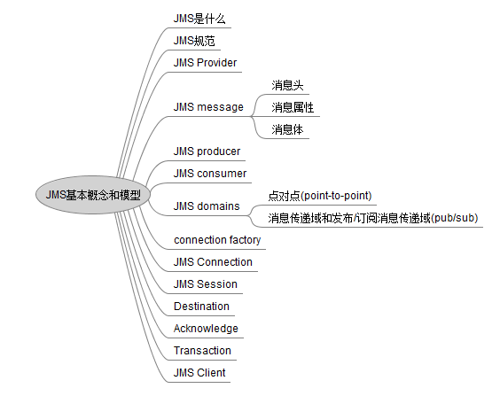
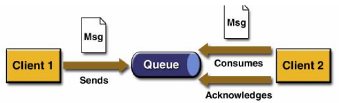
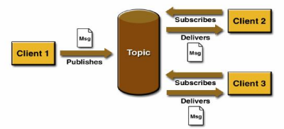

**JMS基本概念和模型**

-------------------------------------------------------------------------------------------

JMS是什么
　　JMS 全称:Java Message Service,Java消息服务，是Java EE中的一个技术。

JMS规范

　　JMS定义了Java 中访问消息中间件的接口,并没有给予实现,实现JMS接口的消息中间件成为JMS Provider,例如：Active MQ

JMS Provider

　　实现JMS接口和规范的消息中间件

JMS message

　　JMS的消息，JMS消息由三部分组成:消息头、消息属性、消息体

　　消息头包含消息的识别消息和路由消息，消息头包含一些标准的属性如下：

　　 (1)JMSDeliveryMode: 消息发送的目的地，主要是指Queue和Topic，由send方法设置.

　　 (2)**JMSDeliveryMode**:传送模式。有两种：持久模式和非持久模式。一条持久性的消息应该被传输"一次仅仅一次"，这就意味着如果JMS提供者出现故障，该消息并不会丢失，它会在服务器恢复之后再次传递。一条非持久的消息最多会传递一次，这意味着服务器出现故障，该消息将永远丢失。由send方法设置

　　 (3)JMSExpiration:消息过期时间，等于Destination的send方法中的timeToLive值加上发送时刻的GMT的时间值。如果timeToLive值等于零，则JMSExpiration被设置为零，表示该消息永不过期。如果发送后，在消息过期时间之后消息还没有被发送到目的地，则该消息被清除。由send方法设置

　　 (4)JMSPriority:消息优先级，从0-9十个级别，0-4是普通消息，5-9是加急消息。JMS不要求JMS Provider严格按照这十个优先级发送消息，但必须保证加急消息要先于普通消息到达，默认是4级。由send方法设置

　　 (5)JMSMessageID:唯一识别每个消息的标识，由JMS Provider产生。由send方法设置

　　 (6)JMSTimestamp:一个JMS Provider在调用send()方法时自动设置，它是消息被发送和消费者实际接收的时间差。由客户端设置

　　 (7)JMSCorrelationID:用来连接到另外一个消息，典型的应用是在回复消息中连接到原消息。在大多数情况下，JMSCorrelationID用于将一条消息标记为对JMSMessageID标示的上一条消息的应答，不过，JMSCorrelationID可以是任何值，不仅仅是JMSMessageID。由客户端设置

　　 (8)**JMSType**: 消息类型的标识符，由客户端设置

　　 (9)**JMSReplyTo**: 提供本消息回复消息的目的地址,由客户端设置

　　 (10)JMSRedelivered:如果一个客户端收到一个设置了JMSRedelivered属性的消息，则表示可能客户端曾经在早些时候收到过该消息，但并没有签收(acknowledged)。如果该消息被重新传送，JMSRedelivered=true 否则 JMSRedelivered=flase 。由JMS Provider设置

　　消息体，JMS API定义了5种消息体格式，也叫消息类型，可以使用不同形式发送接收数据，并可以兼容现有的消息格式。

　　　　包括:**TextMessage、MapMessage、BytesMessage、StreamMessage、ObjectMessage**

　　消息属性,包含以下三种类型的属性:

　　　　1.应用程序设置和添加的数据，比如：message.setStringProperty("userName",userName);

　　　　2.JMS定义的属性，使用"JMSX"作为属性名的前缀, connection.getMetaData().getJMSXPropertyNames() 方法返回所有连接支持的JMSX属性的名字。

　　　　3.JMS供应商特定的属性

**JMS producer**

　　消息生产者,创建和发送JMS消息的客户端应用

**JMS consumer**

　　消息消费者,创建和处理JMS消息的客户端应用

**JMS domains**: 消息传递域

　　JMS规范中定义了两种消息传递域： 点对点(point-to-point,简写成PTP);消息传递域和发布/订阅消息传递域(publish/subscribe,简写成pub/sub)

　　1.**点对点消息传递域**的特点如下:

　　　a.每个消息只能有一个消费者

　　　b.消息的生产者和消费者之间没有时间上的相关性。无论消费者在生产者发送消息的时候是否处于运行状态，它都可以提取消息。

​      

　　2.**发布/订阅消息传递域**的特点如下:

　　　　a.每个消息可以有多个消费者

　　　　b.生产者和消费者之间有时间上的相关性。订阅一个主题的消费者只能消费自它订阅之后发布的消息。JMS规范允许客户创建持久订阅，这在一定程度上放松了时间上的相关性要求。持久订阅允许消费者消费它在未处于激活状态时发送的消息。s

　　　　

　　3.在点对点消息传递域中，目的地被称为队列(**queue**);在发布/订阅消息传递域中,目的地被称为主题(**topic**)

 

Connection factory: 连接工厂,用来创建连接对象，以连接到JMS的provider

JMS Connection: 封装了客户与JMS提供者之间的一个虚拟的连接
JMS Session: 是生产和消费消息的一个单线程上下文
会话用于创建消息生产者(producer)、消息消费者(consumer)和消息(message)等。会话提供了一个事务性的上下文，在这个上下文中，一组发送和接收被组合到了一个原子操作中。
Destination:消息发送到的目的地
Acknowledge:签收
Transaction:事务
JMS client: 用来收发消息的Java应用

Non- JMS client:使用 JMs provider本地API写的应用,用来替换 JMS API实现收发消息的功能,通常会提供其他的一些特性,比如: CORBA、RMI等

 Administered objects:预定义的JMS对象,通常在 provide1规范中有定义,提

供给JM客广来访问,比如: Connectionfactory和 Destination
